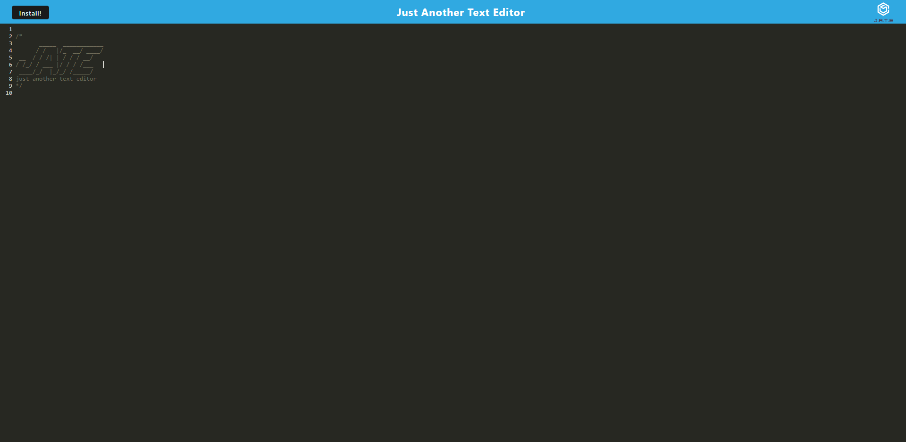
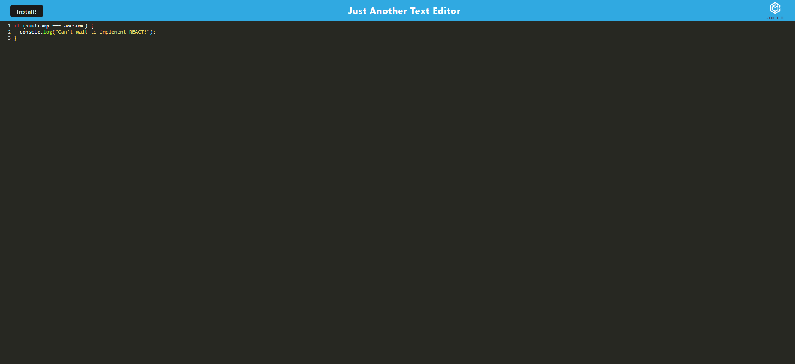

# Text-Editor

## Description
This project was created to demonstrate my ability to use and understand PWA's(Progressive Web Apps). Using technologies such as webpack, IndexedDb, inject manifest, JavaScript, service workers, and node, you will be able to create and use a simple text editor. You are also able to install the app. Using local storage and IndexedDb, you are able to navigate this app offline. You will be able to use see your indexedDb database from the dev tools. Deployed using Heroku, this is a live application that can be used right now.

## Installation
1. Download and Install Node.js. 
2. Download the source code.
3. Run npm i to initialize.
4. Run npm run build from the root and let the webpack build.
5. Run npm start and follow the terminal instructions.

## Screenshot

## Deployed Application
https://boiling-mesa-85788.herokuapp.com/
